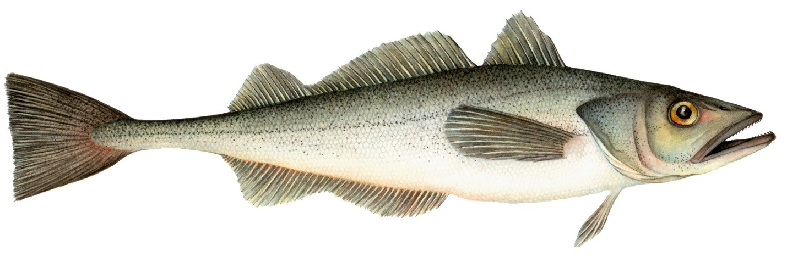

```{r setup, echo=FALSE, cache=FALSE, message=FALSE, results='hide', warning=FALSE}
knitr::opts_chunk$set(echo = FALSE,
                      error = FALSE,
                      warning = FALSE,
                      message = FALSE,
                      results = FALSE,
                      cache = TRUE,
                      autodep = TRUE,
                      cache.comments = FALSE,
                      fig.align = "center",
                      fig.width = 7,
                      fig.height = 4,
                      dev = 'svg',
                      fig.asp = 0.618)
options(htmltools.dir.version = FALSE)
```

```{r load-libraries, cache = FALSE}
library(knitr)
library(kableExtra)
library(here)
library(tidyverse)
library(gfutilities)
library(hakedata)
library(mapview)
```

```{r load-code}
source(here::here("R/generate-data.R"))
source(here::here("R/spatial.R"))

extract_date <- Sys.Date()
year <- 2019
coastwide_tac <- 519834
canada_prop <- 0.2612
canada_tac_nocarryover <- coastwide_tac * canada_prop
carryover <- 20286
canada_tac <- canada_tac_nocarryover + carryover
landings_enddate <- lubridate::date(extract_date)
landings_to_extractdate <- 0
total_can_catch <- sum(ct_ft$landings, ct_ss$landings, ct_jv$landings) / 10e3
ft_perc <- sum(ct_ft$landings) / 10e3 / total_can_catch * 100
ss_perc <- sum(ct_ss$landings) / 10e3 / total_can_catch * 100
jv_perc <- sum(ct_jv$landings) / 10e3 / total_can_catch * 100
alloc_perc <- total_can_catch / canada_tac * 100

tl <- tribble(
  ~description, ~value,
  paste0(year, " Coastwide TAC"),                                      paste0(f(coastwide_tac), " mt"),
  paste0("Canadian TAC (", f(canada_prop * 100, 2), "%)"),             paste0(f(canada_tac_nocarryover), " mt"),
  "Canadian carryover",                                                paste0(f(carryover), " mt"),
  paste("Total landings up to ", extract_date),                        paste0(f(total_can_catch), " mt"),
  paste("% of TAC caught by Canadian fisheries up to ", extract_date), paste0(f(alloc_perc, 1), " %"),
  "% of Canadian catch caught by Freezer Trawlers",                    paste0(f(ft_perc, 1), " %"),
  "% of Canadian catch caught by Shoreside",                           paste0(f(ss_perc, 1), " %"),
  "% of Canadian catch caught by Joint Venture",                       paste0(f(jv_perc, 1), " %")
)
```

## 2019 Canadian Pacific Hake fishery



<div style = "position: absolute; bottom: 5px>
<font size = "8" family = "PT Sans">
<p class = "note">
Joint Techincal Committee
</p>
</font>
</div>

# #TAC and landed catch

*All catch values are preliminary*
<font size = "5">
```{r tac-landing-table,results = 'asis'}
kable(tl, col.names = NULL)
```
</font>

# Freezer trawler cumulative catch
```{r cumu-catch-ft}
plot_cumu_catch(ct_ft, ylim = c(1, 60), horiz_line_spacing = 10)
```

# Shoreside cumulative catch
```{r cumu-catch-ss}
plot_cumu_catch(ct_ss, ylim = c(1, 60), horiz_line_spacing = 10)
```

# JV cumulative catch
```{r cumu-catch-jv}
plot_cumu_catch(ct_jv, ylim = c(1, 10))
```

# Freezer trawler spatial catch
```{r spatial-catch-ft}
plot_spatial(grd_ft)
```

# Freezer trawler spatial catch - detail
```{r spatial-catch-ft-detail}
plot_spatial(grd_ft, 
             extents = data.frame(lon = c(-130, -125),
                                  lat = c(48, 52.3)))
```

# Shoreside spatial catch
```{r spatial-catch-ss}
plot_spatial(grd_ss)
```

# Shoreside spatial catch - detail
```{r spatial-catch-ss-detail}
plot_spatial(grd_ss, 
             extents = data.frame(lon = c(-130, -125),
                                  lat = c(48, 52.3)))
```
