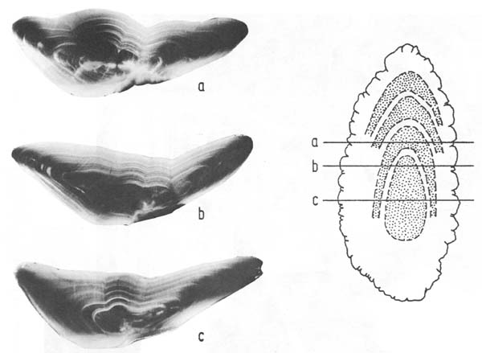
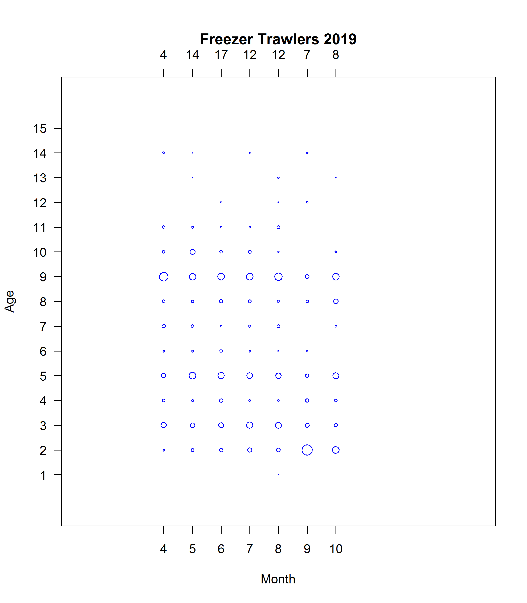
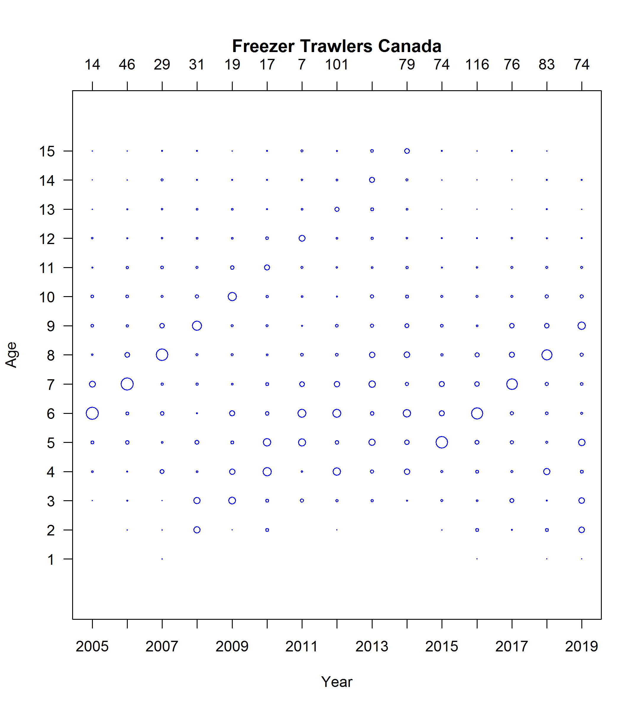
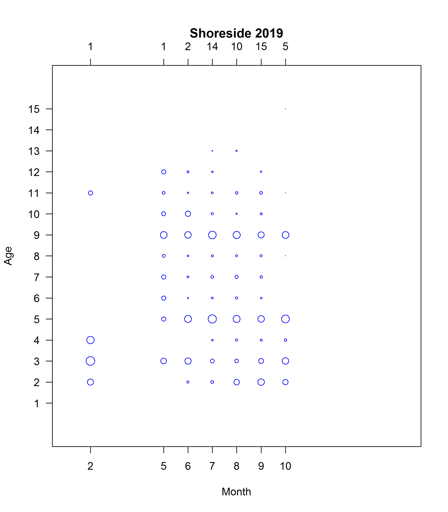
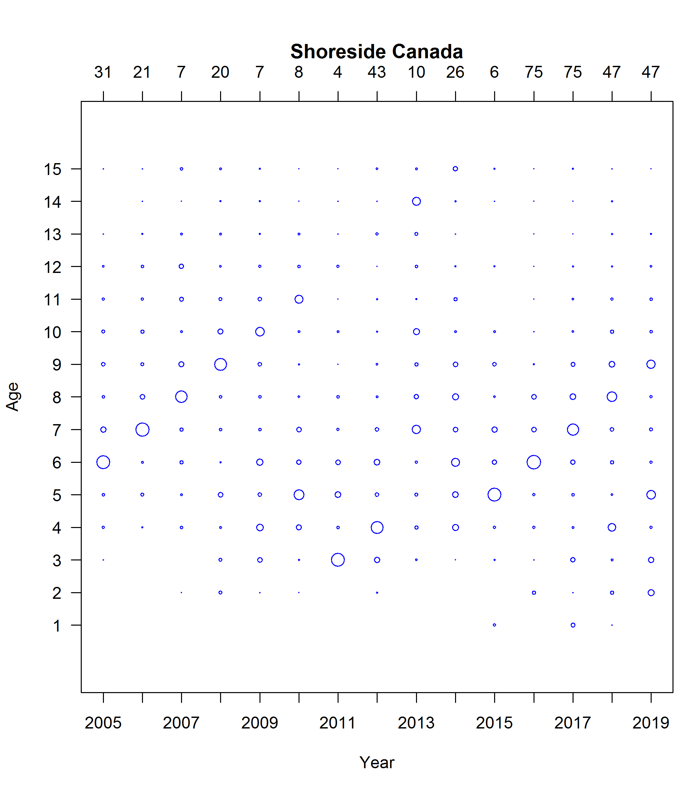

```{r setup, echo=FALSE, cache=FALSE, message=FALSE, results='hide', warning=FALSE}
knitr::opts_chunk$set(echo = FALSE,
                      error = FALSE,
                      warning = FALSE,
                      message = FALSE,
                      results = FALSE,
                      cache = TRUE,
                      autodep = TRUE,
                      cache.comments = FALSE,
                      fig.align = "center",
                      fig.width = 7,
                      fig.height = 4,
                      dev = 'svg',
                      fig.asp = 0.618)
options(htmltools.dir.version = FALSE)
```

```{r load-libraries, cache = FALSE}
library(knitr)
library(kableExtra)
library(here)
library(tidyverse)
library(gfutilities)
library(hakedata)
```

```{r load-code}
source(here::here("R/generate-data.R"))
source(here::here("R/spatial.R"))

extract_date <- Sys.Date()
year <- 2019
coastwide_tac <- 519834
canada_prop <- 0.2612
canada_tac_nocarryover <- coastwide_tac * canada_prop
carryover <- 20286
canada_tac <- canada_tac_nocarryover + carryover
landings_enddate <- lubridate::date(extract_date)
landings_to_extractdate <- 0
total_can_catch <- sum(ct_ft$landings, ct_ss$landings, ct_jv$landings) / 10e3
ft_perc <- sum(ct_ft$landings) / 10e3 / total_can_catch * 100
ss_perc <- sum(ct_ss$landings) / 10e3 / total_can_catch * 100
jv_perc <- sum(ct_jv$landings) / 10e3 / total_can_catch * 100
alloc_perc <- total_can_catch / canada_tac * 100

tl <- tribble(
  ~description, ~value,
  paste0(year, " Coastwide TAC"),                                      paste0(f(coastwide_tac), " mt"),
  paste0("Canadian TAC (", f(canada_prop * 100, 2), "%)"),             paste0(f(canada_tac_nocarryover), " mt"),
  "Canadian carryover",                                                paste0(f(carryover), " mt"),
  paste("Total landings up to ", extract_date),                        paste0(f(total_can_catch), " mt"),
  paste("% of TAC caught by Canadian fisheries up to ", extract_date), paste0(f(alloc_perc, 1), " %"),
  "% of Canadian catch caught by Freezer Trawlers",                    paste0(f(ft_perc, 1), " %"),
  "% of Canadian catch caught by Shoreside",                           paste0(f(ss_perc, 1), " %"),
  "% of Canadian catch caught by Joint Venture",                       paste0(f(jv_perc, 1), " %")
)
extents <- data.frame(lon = c(-131, -124),
                      lat = c(48, 52.3))
```

## Data for the 2019 Canadian Hake fishery


<div style = "position: absolute; bottom: 5px>
<font size = "8" family = "PT Sans">
<p class = "note">
Joint Techincal Committee
</p>
</font>
</div>

---

## TAC and landed catch

*All catch values are preliminary*
<font size = "5">
```{r tac-landing-table,results = 'asis'}
kable(tl, col.names = NULL)
```
</font>

---

# Freezer trawler cumulative catch
```{r cumu-catch-ft}
plot_cumu_catch(ct_ft, ylim = c(1, 60), horiz_line_spacing = 10)
```

---

# Shoreside cumulative catch
```{r cumu-catch-ss}
plot_cumu_catch(ct_ss, ylim = c(1, 60), horiz_line_spacing = 10)
```

<!-- # JV cumulative catch -->
<!-- ```{r cumu-catch-jv} -->
<!-- plot_cumu_catch(ct_jv, ylim = c(1, 10)) -->
<!-- ``` -->

---

# Freezer trawlers number of fishing events
```{r spatial-ft}
plot_spatial(grd_ft)
```

---

# Freezer trawlers number of fishing events - detail
```{r spatial-ft-detail}
plot_spatial(grd_ft,
             extents = extents)
```

---

# Freezer trawlers sum of catch
```{r spatial-ft-sum-catch}
plot_spatial(grd_sum_catch_ft,
             data_col = "catch",
             data_factor = 1000,
             extents = extents)
```

---

# Freezer trawlers mean catch
```{r spatial-ft-catch}
plot_spatial(grd_catch_ft,
             data_col = "catch",
             data_factor = 1000,
             extents = extents)
```

---

# Shoreside number of fishing events
```{r spatial-ss}
plot_spatial(grd_ss)
```

---

# Shoreside number of fishing events - detail
```{r spatial-ss-detail}
plot_spatial(grd_ss,
             extents = extents)
```

---

# Shoreside sum of catch
```{r spatial-ss-sum-catch}
plot_spatial(grd_sum_catch_ss,
             data_col = "catch",
             data_factor = 1000,
             extents = extents)
```

---

# Shoreside mean catch
```{r spatial-ss-catch}
plot_spatial(grd_catch_ss,
             data_col = "catch",
             data_factor = 1000,
             extents = extents)
```

---

## Canadian age proportions


---



---



---



---



---

## Bottom depths of tows
```{r depth-plot}
plot_depths(ct_depths,
            plot_type = "box",
            legend_loc = "outside")
```

---

## Bottom depths of tows 2019
```{r depth-plot-histogram}
plot_depths(ct_depths %>% filter(lubridate::year(catchdate) %in% yrs),
            xlim = c(0, 1000),
            bin_width = 20)
```

---

## Length frequencies 2019
```{r length-plot-histogram}
plot_lengths(yrs = 2019, xlim = c(0, 80), bin_width = 2)
```

---

## Length frequencies 1972 - present
```{r length-plot-histogram-all-years}
plot_lengths(xlim = c(0, 80), bin_width = 2)
```

---


